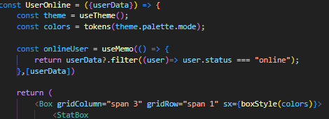
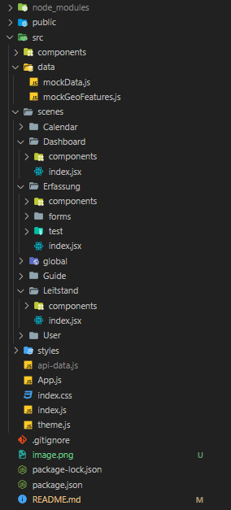

# Data Visualization Tool (React)

Tech: React, Material UI, Data Grid, Light & Dark Mode

A Tool for Overviewing all the incoming data in a logistics Company built with React.
Designed for interactive and intuitive exploration of complex datasets, it offers a range of customizable charts and graphs to bring data to life.

.png>)

Interactive charts and graphs
Real-time data updates
Customizable color schemes and layouts
Responsive design for various devices

## React

I optimize the performance of my components by preventing them from re-rendering unless specific data changes.


## Project Architecture



## Installation

To install this project, run the following commands:

```bash

Follow these steps to set up the project:

git clone https://github.com/crowtek/Data-Visualization-Tool.git
cd Data-Visualization-Tool
npm install


- Ensure you have Node.js installed on your system.


```
